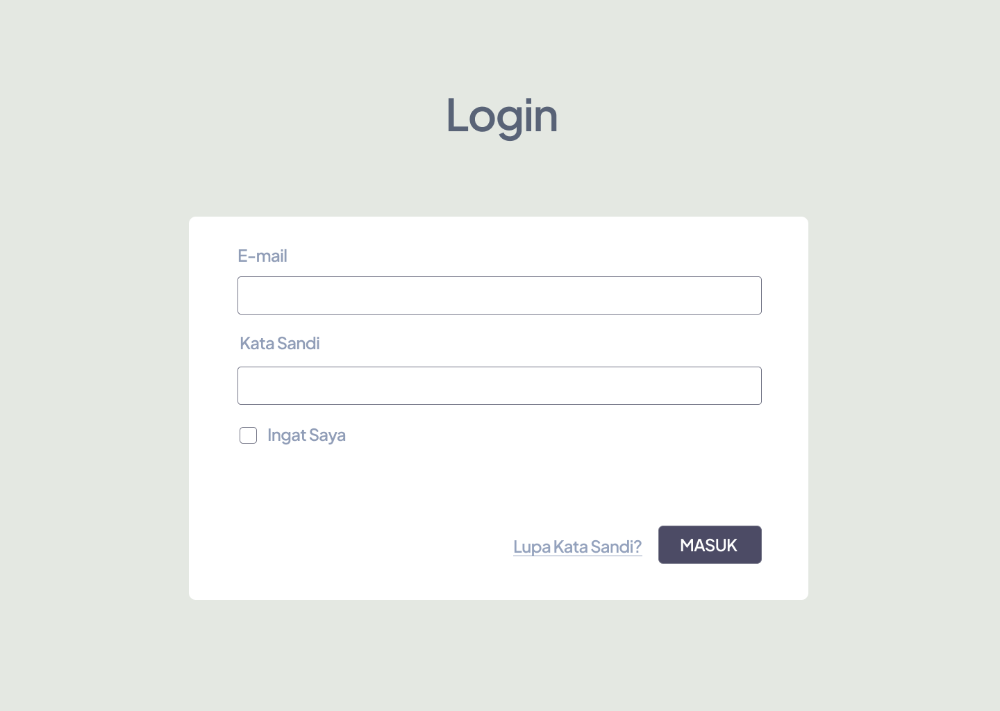
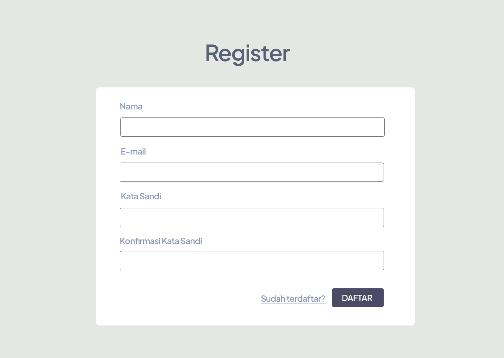
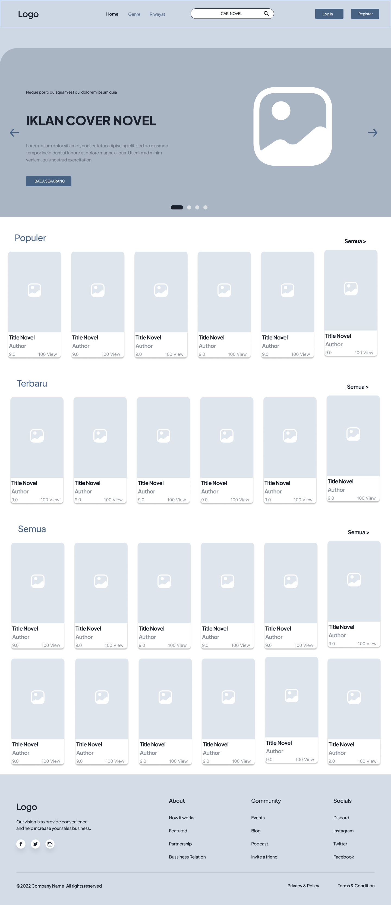
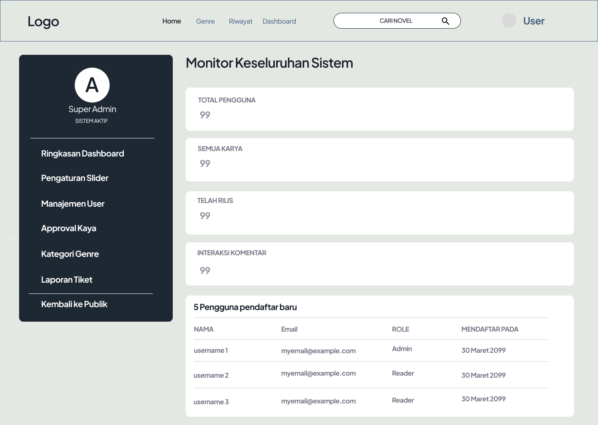
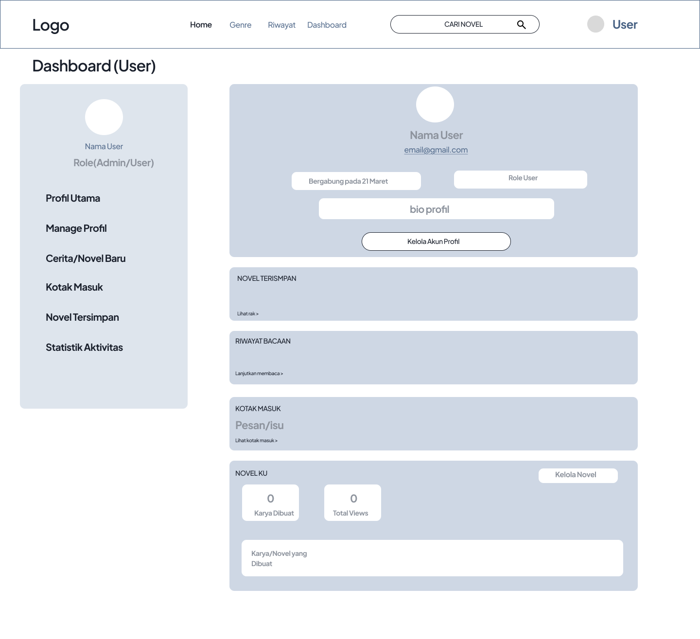
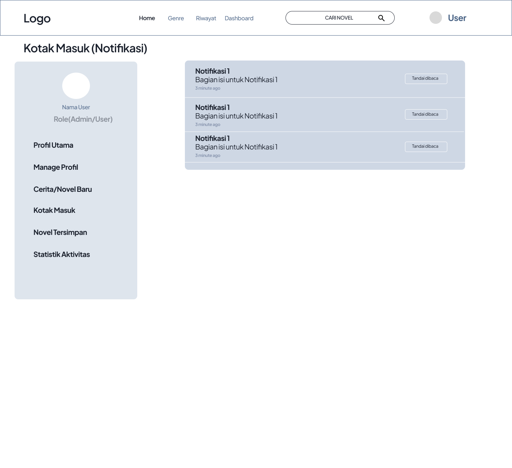

# Dokumentasi Desain Antarmuka (UI/UX Wireframes)

Dokumen ini berisi informasi mengenai proses perancangan antarmuka (UI/UX) untuk platform **Noctale Web Novel**, tautan kerja Figma, serta daftar pratinjau gambar wireframe yang diarsipkan di dalam repositori.

---

## 🎨 Tautan Figma (Desain Kerja Asli)

Desain kerja kolaboratif interaktif dan seluruh aset visual utama dapat diakses langsung pada Figma melalui tautan berikut:

*   [**Desain Mockup & Wireframe UI/UX Lengkap (Figma)**](https://www.figma.com/design/i2T4dtR7plU1D61jr2Oq1U/Untitled?node-id=1-2&t=J7yIfA8f4x13HxDy-0)

---

## 📸 Arsip Pratinjau Gambar Antarmuka (UI Wireframes)

Berikut adalah daftar screenshot mockup wireframe halaman-halaman utama platform Noctale yang tersimpan di direktori `docs/desain-ui/`:

### 1. Autentikasi Pengguna (Login & Register)
Halaman pintu masuk bagi pengguna untuk mendaftarkan akun baru atau masuk ke akun yang sudah ada.
*   **Wireframe Login:**
    
*   **Wireframe Register:**
    

---

### 2. Halaman Beranda Publik (Home Page)
Menampilkan tata letak utama slider promosi banner, daftar genre, novel populer, update terbaru, serta sistem pencarian publik.
*   **Wireframe Beranda:**
    

---

### 3. Halaman Baca Chapter (Reader Mode)
Menampilkan desain halaman membaca novel yang minimalis, panel preferensi membaca, serta area diskusi komentar.
*   **Wireframe Baca Chapter:**
    

---

### 4. Dasbor Penulis (Writer Dashboard)
Menampilkan antarmuka bagi penulis untuk mengelola karya novel, mengunggah sampul, menulis bab baru, serta melihat ringkasan statistik.
*   **Wireframe Kelola Karya:**
    
*   **Wireframe Kelola Novel:**
    

---

### 5. Dasbor Pengelolaan Super Admin (Admin Area)
Menampilkan antarmuka administratif untuk mengawasi akun pengguna, moderasi laporan tiket pelanggaran, menyetujui novel baru, dan mengelola genre.
*   **Wireframe Dashboard Utama Admin:**
    
*   **Wireframe Manajemen User:**
    
*   **Wireframe Manajemen Genre:**
    
*   **Wireframe Laporan Tiket (Moderasi):**
    

---

### 6. Profil Pengguna & Statistik
Menampilkan halaman bio pengguna publik beserta statistik aktivitas baca tulisnya.
*   **Wireframe Profil Pengguna:**
    
*   **Wireframe Statistik Aktivitas:**
    

---

### 7. Fitur Pendukung (Kotak Masuk, Bookmark, Riwayat)
Halaman ringkasan interaksi pengguna untuk melacak notifikasi, novel yang disimpan, dan riwayat bab yang dibaca.
*   **Wireframe Notifikasi (Inbox):**
    
*   **Wireframe Novel Tersimpan (Bookmark):**
    
*   **Wireframe Riwayat Membaca:**
    .png)

---

## 💡 Petunjuk untuk Tim Frontend & Evaluator
- **Resolusi Gambar:** Desain diekspor langsung dari Figma dengan resolusi optimal agar tulisan wireframe terlihat jelas saat ditinjau melalui browser.
- **Konsistensi Desain:** Pastikan komponen Tailwind CSS di frontend merujuk pada struktur layout kotak kawat (wireframe) di atas untuk menjaga konsistensi proporsi antarmuka.
